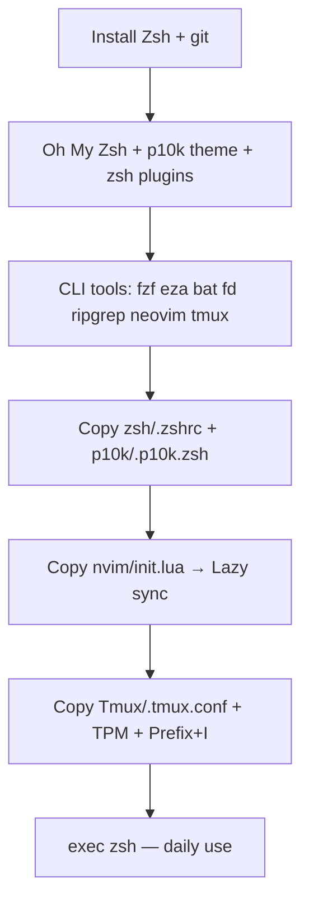

# My Workflow — terminal dev environment

Dotfiles and configs for a **terminal-first** development setup: Zsh with Oh My Zsh and Powerlevel10k, Neovim as the editor, and Tmux for persistent sessions. Everything is versioned in this repo; you copy or symlink files into your home directory.

**Best on:** Linux, macOS, or **WSL2** on Windows. Native Windows terminals can use Neovim from `%LOCALAPPDATA%\nvim\`; Zsh/Tmux are intended for Unix-like environments.

---

## What you get

| Layer | Config | Highlights |
|-------|--------|------------|
| **Shell** | [`zsh/.zshrc`](zsh/.zshrc) | Oh My Zsh, autosuggestions, syntax highlighting, fzf, zoxide, eza, lazygit, Superfile |
| **Prompt** | [`p10k/.p10k.zsh`](p10k/.p10k.zsh) | Powerlevel10k (classic powerline, Nerd Font, transient prompt) |
| **Editor** | [`nvim/init.lua`](nvim/init.lua) | lazy.nvim, Tokyo Night, nvim-tree, Telescope, Treesitter, ToggleTerm |
| **Multiplexer** | [`Tmux/.tmux.conf`](Tmux/.tmux.conf) | Catppuccin, TPM plugins, Ctrl+Space prefix, session restore |

Detailed install steps, keymaps, and troubleshooting live in each folder’s guide:

| Component | Guide |
|-----------|--------|
| Zsh + tools | [`zsh/readme.md`](zsh/readme.md) |
| Powerlevel10k | [`p10k/readme.md`](p10k/readme.md) |
| Neovim | [`nvim/readme.md`](nvim/readme.md) |
| Tmux | [`Tmux/readme.md`](Tmux/readme.md) |

---

## Repository layout

```text
My Workflow/
├── readme.md           # This file — start here
├── zsh/
│   ├── .zshrc          # → ~/.zshrc
│   └── readme.md
├── p10k/
│   ├── .p10k.zsh       # → ~/.p10k.zsh
│   └── readme.md
├── nvim/
│   ├── init.lua        # → ~/.config/nvim/init.lua
│   └── readme.md
└── Tmux/
    ├── .tmux.conf      # → ~/.tmux.conf
    └── readme.md
```

On your machine you will also have (not in the repo):

```text
~/.oh-my-zsh/              # Oh My Zsh
~/.tmux/plugins/tpm/       # Tmux Plugin Manager
~/.local/share/nvim/lazy/  # Neovim plugins (lazy.nvim)
```

---

## Quick start (full stack)

Replace `/path/to/My Workflow` with your clone path (e.g. `D:\MD\Project\My Workflow` in WSL: `/mnt/d/MD/Project/My Workflow`).

### 1. Prerequisites

| Requirement | Why |
|-------------|-----|
| **Zsh** | Default shell for this stack |
| **git** | Oh My Zsh plugins, lazy.nvim, TPM |
| **curl** or **wget** | Install scripts |
| **Nerd Font v3** | Icons in p10k, eza, nvim-tree, tmux status |
| **Neovim 0.9+** | Editor |
| **tmux** | Optional but recommended for long sessions |

Install Zsh and set it as login shell (Ubuntu example):

```bash
sudo apt update
sudo apt install -y zsh git curl
chsh -s "$(which zsh)"
```

Log out and back in, then continue in a **Zsh** session.

### 2. Oh My Zsh + Powerlevel10k + Zsh plugins

Follow [`zsh/readme.md`](zsh/readme.md) sections 2–4 for:

- Oh My Zsh
- Powerlevel10k theme clone
- `zsh-autosuggestions`, `zsh-syntax-highlighting`, `zsh-completions`

### 3. CLI tools (shell)

From [`zsh/readme.md`](zsh/readme.md) §5 — at minimum for the aliases in `.zshrc`:

```bash
# Debian / Ubuntu example
sudo apt install -y fzf fd-find bat eza ripgrep neovim tmux
# Optional: zoxide, lazygit — see zsh readme for install commands
```

Also install [Superfile](https://superfile.dev/) if you use `sf`, `ff`, `ffz`, or `sfe`.

### 4. Deploy configs from this repo

**Copy everything:**

```bash
REPO="/path/to/My Workflow"

cp "$REPO/zsh/.zshrc" ~/.zshrc
cp "$REPO/p10k/.p10k.zsh" ~/.p10k.zsh
mkdir -p ~/.config/nvim
cp "$REPO/nvim/init.lua" ~/.config/nvim/init.lua
cp "$REPO/Tmux/.tmux.conf" ~/.tmux.conf
```

**Or symlink** (repo updates apply after reload):

```bash
REPO="/path/to/My Workflow"

ln -sf "$REPO/zsh/.zshrc" ~/.zshrc
ln -sf "$REPO/p10k/.p10k.zsh" ~/.p10k.zsh
mkdir -p ~/.config/nvim
ln -sf "$REPO/nvim/init.lua" ~/.config/nvim/init.lua
ln -sf "$REPO/Tmux/.tmux.conf" ~/.tmux.conf
```

### 5. Tmux Plugin Manager (one time)

```bash
git clone https://github.com/tmux-plugins/tpm ~/.tmux/plugins/tpm
```

Start tmux, press **Ctrl+Space** then **Shift+I** to install plugins. See [`Tmux/readme.md`](Tmux/readme.md).

### 6. Neovim plugins (one time)

```bash
nvim
```

Inside Neovim:

```vim
:Lazy sync
```

See [`nvim/readme.md`](nvim/readme.md).

### 7. Prompt (optional)

If you want to change the prompt interactively instead of using the bundled `.p10k.zsh`:

```bash
p10k configure
```

### 8. Reload

```bash
exec zsh
```

---

## Recommended install order



1. **Shell foundation** — Zsh, Oh My Zsh, plugins, `.zshrc`, `.p10k.zsh`
2. **Editor** — `init.lua`, `:Lazy sync`, `:TSUpdate` if needed
3. **Tmux** — `.tmux.conf`, TPM, plugin install
4. **Terminal font** — Nerd Font in your terminal emulator settings

Skipping Tmux is fine if you only want shell + Neovim.

---

## How the pieces fit together

```text
┌─────────────────────────────────────────────────────────────┐
│  Terminal (Alacritty, Windows Terminal, iTerm2, …)          │
│  Font: Nerd Font v3                                         │
└───────────────────────────┬─────────────────────────────────┘
                            │
              ┌─────────────▼─────────────┐
              │  tmux (optional)           │
              │  Prefix: Ctrl+Space      │
              │  Catppuccin + TPM plugins  │
              └─────────────┬─────────────┘
                            │
              ┌─────────────▼─────────────┐
              │  zsh + Oh My Zsh          │
              │  p10k prompt, fzf, zoxide │
              │  EDITOR=nvim, v → nvim    │
              └─────────────┬─────────────┘
                            │
         ┌──────────────────┼──────────────────┐
         ▼                  ▼                  ▼
    neovim            lazygit (lg)      superfile (sf)
    Telescope         git aliases       ffz / sfe → nvim
```

- **Zsh** sets `EDITOR=nvim` and `alias v=nvim`.
- **Neovim** uses **zsh** for `:terminal` / ToggleTerm (`<C-\>`).
- **Tmux** + **vim-tmux-navigator** (plugin) share **Ctrl+h/j/k/l** with Neovim window navigation when the editor plugin is added; Neovim’s built-in maps already use those keys for splits.
- **fzf** (**Ctrl+T**, **Ctrl+R**) and **zoxide** (`z`, `zi`) speed up navigation before you open files in Neovim.

---

## Daily workflow

| Goal | What to run |
|------|-------------|
| New persistent session | `tmux` (detach: **Prefix** `d`) |
| Jump to a project | `z project-name` or `zi` |
| Find a file on disk | **Ctrl+T** (fzf) or `ffz` → Superfile |
| Edit in Neovim | `v .` or `sfe` (pick file in Superfile) |
| Git UI | `lg` (lazygit) |
| Find file inside Neovim | `<Space>ff` (Telescope) |
| Grep in project | `<Space>fg` |
| File tree in Neovim | `<Space>e` |
| Embedded terminal in Neovim | `<C-\>` |
| Docker compose | `dcu` / `dcd` / `dcl` |

After editing dotfiles in this repo:

```bash
source ~/.zshrc          # shell changes
tmux source-file ~/.tmux.conf   # tmux changes
# Neovim: restart or :Lazy sync if plugins changed
```

---

## Keybindings cheat sheet

Leaders and prefixes differ per tool — this table is the **minimum** to remember; full tables are in each sub-guide.

### Zsh / fzf

| Keys | Action |
|------|--------|
| **Ctrl+T** | Fuzzy file → insert path |
| **Ctrl+R** | Fuzzy command history |
| **Alt+C** | Fuzzy directory → `cd` |
| **→** | Accept autosuggestion |

### Neovim (leader = Space)

| Key | Action |
|-----|--------|
| `<leader>e` | File tree |
| `<leader>ff` | Find files |
| `<leader>fg` | Live grep |
| `<leader>fb` | Buffers |
| `<leader>fh` | Help |
| `<C-\>` | Toggle terminal |
| `<C-s>` | Save |
| `<C-h/j/k/l>` | Move between windows |

### Tmux (prefix = Ctrl+Space)

| Keys | Action |
|------|--------|
| **Prefix** `d` | Detach |
| **Prefix** `\|` / `+` | Split horizontal / vertical |
| **Prefix** `I` | Install TPM plugins |
| **Prefix** `[` | Copy mode / scroll |

More: [`Tmux/readme.md`](Tmux/readme.md) · [`nvim/readme.md`](nvim/readme.md) · [`zsh/readme.md`](zsh/readme.md)

---

## Dependency overview

Install details and per-package notes are in [`zsh/readme.md`](zsh/readme.md). Summary:

| Package | Used by |
|---------|---------|
| zsh, Oh My Zsh, Powerlevel10k | Shell + prompt |
| zsh-autosuggestions, zsh-syntax-highlighting, zsh-completions | Shell plugins |
| fzf, fd-find, bat, eza | Shell navigation & listing |
| zoxide | Smart `cd` (`z`, `zi`) |
| lazygit | `lg` |
| superfile | `sf`, `ff`, `ffz`, `sfe` |
| neovim, git, ripgrep | Editor + lazy.nvim + Telescope grep |
| tmux + TPM + plugins | Multiplexer |
| docker / compose | Optional aliases in `.zshrc` |
| build-essential (or equivalent) | Treesitter parser compile |

**Neovim scope:** This repo’s `init.lua` is **UI + navigation** (no LSP, completion, or DAP). Extend `init.lua` when you need language servers.

---

## Platform notes

### Linux / macOS

Use the paths above (`~/.zshrc`, `~/.config/nvim/init.lua`, etc.). macOS: prefer `brew install` for tools — see [`zsh/readme.md`](zsh/readme.md).

### Windows

| Approach | Shell / Tmux | Neovim |
|----------|----------------|--------|
| **WSL2** (recommended) | Full stack as on Linux | `~/.config/nvim/init.lua` inside WSL |
| **Native Windows** | Limited; use WSL for Zsh/Tmux | `%LOCALAPPDATA%\nvim\init.lua` — see [`nvim/readme.md`](nvim/readme.md) |

`init.lua` sets `shell = "zsh"`. On native Windows without WSL, change shell in `init.lua` or run Neovim from WSL only.

### Terminal font

Install a **Nerd Font v3** (e.g. MesloLGS NF, JetBrainsMono Nerd Font) and select it in your terminal settings. Without it, prompt and UI icons may show as boxes.

---

## Customization

| Change | Edit | Reload |
|--------|------|--------|
| Aliases, fzf, zoxide | `zsh/.zshrc` | `source ~/.zshrc` |
| Prompt segments | `p10k/.p10k.zsh` or `p10k configure` | `source ~/.p10k.zsh` |
| Editor plugins / keys | `nvim/init.lua` | Restart nvim / `:Lazy sync` |
| Tmux theme / plugins | `Tmux/.tmux.conf` | `tmux source-file ~/.tmux.conf` |

Keep Powerlevel10k **instant prompt** at the top of `.zshrc` (already in the repo file). Avoid slow commands above that block.

---

## Troubleshooting (index)

| Symptom | See |
|---------|-----|
| Oh My Zsh / prompt broken | [`zsh/readme.md`](zsh/readme.md), [`p10k/readme.md`](p10k/readme.md) |
| `command not found: eza`, `bat`, `fdfind` | [`zsh/readme.md`](zsh/readme.md) §5, Ubuntu aliases in `.zshrc` |
| fzf keys not working | Install `fzf` package + key-bindings path |
| Neovim plugins missing | `:Lazy sync`, git on PATH |
| Telescope grep empty | Install `ripgrep` |
| Tmux plugins not loading | TPM clone, **Prefix+I**, `run` line last in `.tmux.conf` |
| Tmux + Neovim pane navigation | [vim-tmux-navigator](https://github.com/christoomey/vim-tmux-navigator) (not in `init.lua` yet) |

---

## Maintenance

**Update configs from git:**

```bash
cd "/path/to/My Workflow"
git pull
# If using symlinks, reload shell/tmux/nvim as needed
```

**Update plugins:**

| Tool | Command / keys |
|------|----------------|
| Neovim | `:Lazy sync` |
| Tmux | **Prefix** `u` (TPM update) |
| Oh My Zsh | `omz update` |
| p10k | Re-run `p10k configure` or edit `~/.p10k.zsh` |

---

## Links

- [Oh My Zsh](https://ohmyzsh.sh/)
- [Powerlevel10k](https://github.com/romkatv/powerlevel10k)
- [lazy.nvim](https://github.com/folke/lazy.nvim)
- [Tmux TPM](https://github.com/tmux-plugins/tpm)
- [fzf](https://github.com/junegunn/fzf) · [zoxide](https://github.com/ajeetdsouza/zoxide) · [eza](https://github.com/eza-community/eza)
- [lazygit](https://github.com/jesseduffield/lazygit) · [Superfile](https://superfile.dev/)

---

## License

Personal dotfiles — use and adapt as you like. No warranty; test on a non-production machine first.
